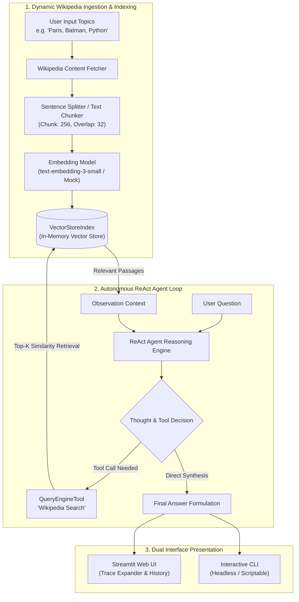

# WikiRAG — Autonomous Wikipedia ReAct Agent & Multi-Topic RAG Chatbot

[](https://streamlit.io/)
[](https://www.llamaindex.ai/)
[](https://platform.openai.com/)
[](https://www.python.org/)
[](tests/)
[](LICENSE)

> **WikiRAG** is a full-stack Retrieval-Augmented Generation (RAG) system combining dynamic in-memory vector indexing with an autonomous **ReAct (Reasoning + Acting)** Agent. It empowers users to index arbitrary Wikipedia topics on-the-fly and converse with an agent that provides verifiable, fact-grounded responses with full reasoning transparency.

---

## Architecture & ReAct RAG Pipeline



---

## Key Features

1. **On-the-Fly Dynamic RAG Indexing:**
   - Index any comma-separated list of Wikipedia topics in real time without pre-baked vector databases.
   - Text chunking with configurable segment sizes and token overlaps to preserve semantic continuity across paragraph boundaries.

2. **Autonomous ReAct Agent:**
   - Implements the **Reasoning + Acting** paradigm: the agent explicitly generates `Thought`, chooses an `Action` (`Wikipedia Search`), passes an `Action Input`, reviews the `Observation`, and iterates until it can synthesize a grounded `Final Answer`.
   - Distinguishes between conversational chatter (answered directly) and domain-specific factual inquiries (routed to the retrieval engine).

3. **Offline Mock & Testing Mode:**
   - Includes a deterministic mock provider with pre-loaded topic corpora (Paris, Batman, Python, Star Wars).
   - Allows recruiters, evaluators, and developers to test the complete indexing, retrieval, and ReAct agent chat interface **locally with zero API keys or external costs**.

4. **Dual Production Interfaces:**
   - **Streamlit Web Dashboard:** Modern card design, customizable RAG sliders (chunk size, overlap, top-k), conversation memory, and collapsible ReAct reasoning trace inspect panels.
   - **CLI Tool (`cli.py`):** Fast, headless command-line interface for single-query execution and terminal chat loops.

---

## ReAct Reasoning Trace Example

When asked a factual question, the agent surfaces its transparent reasoning cycle:

```text
[ReAct Reasoning Trace]
> Thought: The user is asking about 'Who created Batman?'. I need to search the indexed Wikipedia knowledge base.
> Action: Wikipedia Search
> Action Input: Who created Batman?
> Observation: Based on Wikipedia: The character was created by artist Bob Kane and writer Bill Finger, and debuted in Detective Comics #27 in 1939.
> Final Answer: Based on Wikipedia: The character was created by artist Bob Kane and writer Bill Finger, and debuted in Detective Comics #27 in 1939.
```

---

## Repository Structure

```
WikiRAG/
├── src/wikirag/                        # Modular Core Package
│   ├── __init__.py                     # Package exports
│   ├── config.py                       # Pydantic settings & model registry
│   ├── indexer.py                      # Wikipedia parser & VectorStoreIndex builder
│   ├── agent.py                        # ReAct agent loop & tool orchestrator
│   └── mock.py                         # Offline mock provider (zero-API-key testing)
├── tests/                              # Comprehensive Unit Test Suite
│   ├── test_config.py                  # Settings & environment variable tests
│   ├── test_indexer.py                 # Query parsing & indexing tests
│   ├── test_agent.py                   # ReAct agent loop & tool execution tests
│   └── test_mock.py                    # Mock document & retrieval tests
├── streamlit_app.py                    # Modernized Streamlit Web Application
├── cli.py                              # Interactive & scriptable CLI runner
├── requirements.txt                    # Project dependencies
├── .env.example                        # Environment variable template
├── .gitignore                          # Standard Python / IDE exclusions
└── README.md                           # Project documentation
```

---

## Getting Started

### 1. Installation

Clone the repository and install dependencies:
```bash
git clone https://github.com/swarajgupta/Project-Build-an-LLM-powered-Chatbot-with-RAG-using-LlamaIndex.git
cd Project-Build-an-LLM-powered-Chatbot-with-RAG-using-LlamaIndex
pip install -r requirements.txt
```

### 2. Environment Configuration (Optional for Live Mode)

Copy `.env.example` and set your OpenAI API key:
```bash
cp .env.example .env
```
In `.env`:
```ini
OPENAI_API_KEY=sk-your-openai-api-key-here
DEFAULT_MODEL=gpt-4o-mini
```
*(Note: If no API key is provided, the system automatically defaults to `mock-mode`, allowing immediate local testing!)*

---

## Usage

### 1. Launch the Streamlit Web App
```bash
streamlit run streamlit_app.py
```
- Select your model (`gpt-4o-mini`, `gpt-4o`, `gpt-3.5-turbo`, or `mock-mode`).
- Choose a topic preset or enter custom Wikipedia pages (e.g. `Paris, Batman, Python`).
- Click **Build Knowledge Index** and converse with the ReAct agent!

### 2. Run via Command-Line Interface (CLI)
Query a topic directly from your terminal:
```bash
python cli.py --pages "Batman, Paris" --query "Who created Batman?" --model mock-mode
```
Or start an interactive terminal chat session:
```bash
python cli.py --pages "Python, Artificial Intelligence" --model mock-mode
```

---

## Running Automated Tests

Run the complete test suite with pytest:
```bash
python -m pytest tests/
```
All **14 unit tests** pass in ~0.12 seconds with full mock coverage.

---

## License

Distributed under the [MIT License](LICENSE).
